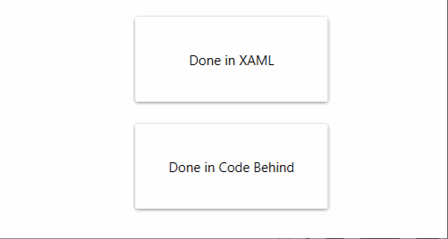

# ShadowAnimation

ShadowAnimation is an example project to animate the shadow of a `MaterialDesignThemes.Wpf.Card` control.
This is implemented in 2 ways:
* [XAML](MainWindow.xaml)
* [code-behind](MainWindow.xaml.cs)

## Controls

|Type|Class name|
|----|----|
|Card|[MaterialDesignThemes.Wpf.Card](https://github.com/MaterialDesignInXAML/MaterialDesignInXamlToolkit/blob/master/MaterialDesignThemes.Wpf/Card.cs)|

## Visual


> Note: This GIF has compression artifacts

## Code documentation

Both implementations achieve the same result.

### XAML

A `DropShadowEffect` is manually defined in the `Effect` property of `Card`. This way it is possible to give the effect a name and animate the effect with triggers.

```xaml
<md:Card.Effect>
    <!--A copy of MaterialDesignShadowDepth1-->
    <DropShadowEffect x:Name="DropShadowEffect" BlurRadius="5" ShadowDepth="1" Direction="270" Color="{StaticResource MaterialDesignShadow}" Opacity=".42" RenderingBias="Performance" />
</md:Card.Effect>
```

There are 2 `EventTrigger`s defined to animate the shadow with `Storyboard`s.
* MouseEnter
* MouseLeave

```xaml
<md:Card.Triggers>
    <!--Values taken from MaterialDesignShadowDepth4 -->
    <EventTrigger RoutedEvent="FrameworkElement.MouseEnter">
        <BeginStoryboard>
            <Storyboard TargetName="DropShadowEffect">
                <DoubleAnimation Storyboard.TargetProperty="BlurRadius" To="25" Duration="0:0:0.5" />
                <DoubleAnimation Storyboard.TargetProperty="ShadowDepth" To="8" Duration="0:0:0.5" />
            </Storyboard>
        </BeginStoryboard>
    </EventTrigger>
    <!--Values taken from MaterialDesignShadowDepth1 -->
    <EventTrigger RoutedEvent="FrameworkElement.MouseLeave">
        <BeginStoryboard>
            <Storyboard TargetName="DropShadowEffect">
                <DoubleAnimation Storyboard.TargetProperty="BlurRadius" To="5" Duration="0:0:0.5" />
                <DoubleAnimation Storyboard.TargetProperty="ShadowDepth" To="1" Duration="0:0:0.5" />
            </Storyboard>
        </BeginStoryboard>
    </EventTrigger>
</md:Card.Triggers>
```

### Code-behind

A `DropShadowEffect` is manually defined in the `Effect` property of `Card`. It is cloned from the `MaterialDesignShadowDepth1` resource so that it can be animated.

```csharp
var shadow1 = (DropShadowEffect)FindResource("MaterialDesignShadowDepth1");

(...)

//Cloning so we only change this instance
var effect = new DropShadowEffect
{
    BlurRadius = shadow1.BlurRadius,
    ShadowDepth = shadow1.ShadowDepth,
    Direction = shadow1.Direction,
    Color = shadow1.Color,
    Opacity = shadow1.Opacity,
    RenderingBias = shadow1.RenderingBias
};
card.Effect = effect;
```

There are 2 `EventTrigger`s defined to animate the shadow with `Storyboard`s.
* MouseEnter
* MouseLeave

```csharp
//Create storyboard for mouse enter
Storyboard mouseEnterStoryboard = new Storyboard();

var enterBlurRadiusAnimation = new DoubleAnimation(shadow2.BlurRadius, new Duration(TimeSpan.FromSeconds(0.5)));
Storyboard.SetTargetProperty(enterBlurRadiusAnimation, new PropertyPath(nameof(DropShadowEffect.BlurRadius)));
Storyboard.SetTarget(enterBlurRadiusAnimation, effect);
mouseEnterStoryboard.Children.Add(enterBlurRadiusAnimation);

var enterShadowDepthAnimation = new DoubleAnimation(shadow2.ShadowDepth, new Duration(TimeSpan.FromSeconds(0.5)));
Storyboard.SetTargetProperty(enterShadowDepthAnimation, new PropertyPath(nameof(DropShadowEffect.ShadowDepth)));
Storyboard.SetTarget(enterShadowDepthAnimation, effect);
mouseEnterStoryboard.Children.Add(enterShadowDepthAnimation);
            
mouseEnterStoryboard.Freeze();

//Create storybaord for mouse leave
Storyboard mouseLeaveStoryboard = new Storyboard();

var leaveBlurRadiusAnimation = new DoubleAnimation(shadow1.BlurRadius, new Duration(TimeSpan.FromSeconds(0.5)));
Storyboard.SetTargetProperty(leaveBlurRadiusAnimation, new PropertyPath(nameof(DropShadowEffect.BlurRadius)));
Storyboard.SetTarget(leaveBlurRadiusAnimation, effect);
mouseLeaveStoryboard.Children.Add(leaveBlurRadiusAnimation);

var leaveShadowDepthAnimation = new DoubleAnimation(shadow1.ShadowDepth, new Duration(TimeSpan.FromSeconds(0.5)));
Storyboard.SetTargetProperty(leaveShadowDepthAnimation, new PropertyPath(nameof(DropShadowEffect.ShadowDepth)));
Storyboard.SetTarget(leaveShadowDepthAnimation, effect);
mouseLeaveStoryboard.Children.Add(leaveShadowDepthAnimation);

mouseLeaveStoryboard.Freeze();


card.MouseEnter += (sender, e) =>
{
    card.BeginStoryboard(mouseEnterStoryboard);
};
card.MouseLeave += (sender, e) =>
{
    card.BeginStoryboard(mouseLeaveStoryboard);
};
```