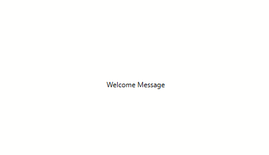

# WelcomeMessage

WelcomeMessage is an example project which shows how to animate a control with a predefined style. 

## Visual


> Note: This GIF has compression artifacts

## Code documentation

### XAML

The style with key 'FadeAfterTenSeconds' is defined in the resources of the window. The effect is started on the `Loaded` event of a `FrameworkElement`-control.

The animation takes 6 seconds to complete and consists of 2 `EasingDoubleKeyFrame`s. They achieve following effect:
* 4 seconds of `UIElement.Opacity` with value 1
* 2 seconds of fading by animating `UIElement.Opacity` to value 0

```xaml
<DoubleAnimationUsingKeyFrames Storyboard.TargetProperty="(UIElement.Opacity)">
    <EasingDoubleKeyFrame KeyTime="0:0:4" Value="1"/>
    <EasingDoubleKeyFrame KeyTime="0:0:6" Value="0" />
</DoubleAnimationUsingKeyFrames>
```