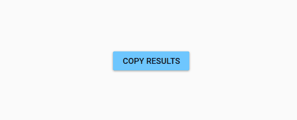

# BadgedAnimation

BadgedAnimation is an example project which shows how to animate a control with a predefined style. 

## Visual


> Note: This GIF has compression artifacts

## Code documentation

### XAML

The badge is applied to the element tha the time it is clicked.

The animation takes 3 seconds to complete and consists of 2 `DiscreteObjectKeyFrame`s. They achieve following effect:
* 0 seconds when elemnt clicked Value changed to 1
* 3 seconds the Value returns to Null, the original state

```xaml
<md:Badged BadgeColorZoneMode="SecondaryMid"
            VerticalAlignment="Center"
            HorizontalAlignment="Center">
    <md:Badged.Style>
        <Style TargetType="md:Badged" BasedOn="{StaticResource {x:Type md:Badged}}">
            <Setter Property="Badge" Value="{md:PackIcon Kind=Check}" />
            <Style.Triggers>
                <Trigger Property="Tag" Value="{x:Null}">
                    <Setter Property="Badge" Value="{x:Null}" />
                </Trigger>
            </Style.Triggers>
        </Style>
    </md:Badged.Style>
    <md:Badged.Triggers>
        <EventTrigger RoutedEvent="{x:Static Button.ClickEvent}" SourceName="MyButton">
            <BeginStoryboard>
                <BeginStoryboard.Storyboard>
                    <Storyboard>
                        <ObjectAnimationUsingKeyFrames Storyboard.TargetProperty="Tag">
                            <DiscreteObjectKeyFrame KeyTime="0:0:0" Value="1" />
                            <DiscreteObjectKeyFrame KeyTime="0:0:3" Value="{x:Null}" />
                        </ObjectAnimationUsingKeyFrames>
                    </Storyboard>
                </BeginStoryboard.Storyboard>
            </BeginStoryboard>
        </EventTrigger>
    </md:Badged.Triggers>
    <Button Content="COPY RESULTS"
            Style="{StaticResource MaterialDesignRaisedLightButton}"
            ToolTip="Copy results to the clipboard"
            x:Name="MyButton">
    </Button>
</md:Badged>
```