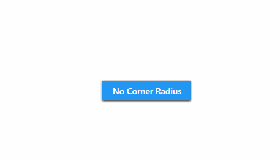

# Button.CornerRadius

Button.CornerRadius is an example project that removes the cornerradius of the default button theme by altering a part of the button template through the attached property `TreeHelpers.Modifiers`.

**Disclaimer:** Modifying the cornerradius is easier with the attached property `ButtonAssist.CornerRadius` on the button-control itself.

## Controls

|Type|Class name|
|----|----|
|Button|[MaterialDesignTheme.Button](https://github.com/MaterialDesignInXAML/MaterialDesignInXamlToolkit/blob/master/MaterialDesignThemes.Wpf/Themes/MaterialDesignTheme.Button.xaml)|

## Visual

