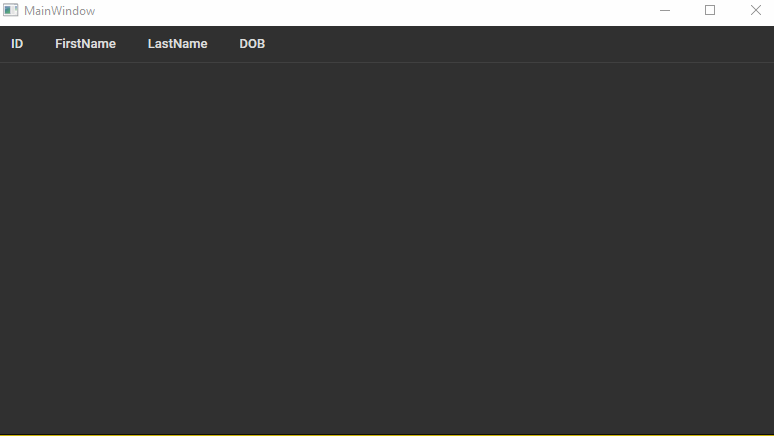

# EFCore

EFCore is an example project which shows how to fetch data using (Entity Framework Core)[https://docs.microsoft.com/en-us/ef/core/] and populates a DataGrid.
It simulates a slow connection so each row has a 100ms delay.


## Visual



## Code documentation

### XAML

```xaml
<DataGrid ItemsSource="{Binding People}" IsReadOnly="True"/>
```

### MainWindowViewModel

Contains a simple constructor that calls (EnableCollectionSynchronization)[https://docs.microsoft.com/en-us/dotnet/api/system.windows.data.bindingoperations.enablecollectionsynchronization] on the (ObservableCollection)[https://docs.microsoft.com/en-us/dotnet/api/system.collections.objectmodel.observablecollection-1].
Data starts to load using the Entity Framework context when the MainWindow has launched, this is implemented in the LoadData method. 


### PeopleContext
A very simple Entity Framework database context that enables access to the data inside the Sqlite data.db file. 