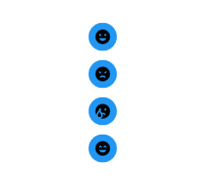

# RadioButton.ToggleButtonStyle

RadioButton.ToggleButtonStyle is an example project which shows how to change the toggle button style with custom animations.

## Visual



## Code documentation

### XAML

The style with key 'MaterialDesignActionRadioButton' is defined in the resources of the window.
It defines a complete radio button style including animated template with checked and unchecked state. 


```xaml
<RadioButton Style="{StaticResource MaterialDesignActionRadioButton}" Margin="0,10,0,0">
    <wpf:PackIcon Kind="Smiley" />
</RadioButton>
<RadioButton Style="{StaticResource MaterialDesignActionRadioButton}" Margin="0,10,0,0">
    <wpf:PackIcon Kind="SmileyAngry" />
</RadioButton>
<RadioButton Style="{StaticResource MaterialDesignActionRadioButton}" Margin="0,10,0,0">
    <wpf:PackIcon Kind="SmileyCry" />
</RadioButton>
<RadioButton Style="{StaticResource MaterialDesignActionRadioButton}" Margin="0,10,0,0">
    <wpf:PackIcon Kind="SmileyExcited" />
</RadioButton>
```