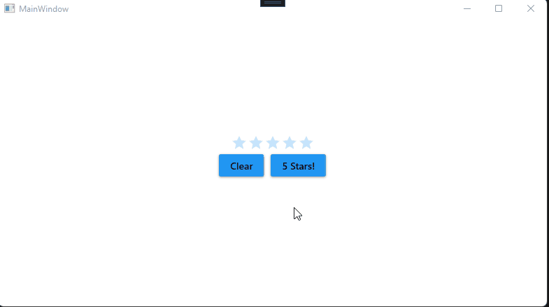

# RatingBar.SelectRatingCommand

RatingBar.SelectRatingCommand is an example project which shows using the SelectRatingCommand routed command.

## Visual



## Code documentation

### XAML

Shows how to set the parameter to the SelectRatingCommand. Because the handler requires a numeric type (version 4.5.0), the parameter must be specified with element syntax.

```xaml
xmlns:materialDesign="http://materialdesigninxaml.net/winfx/xaml/themes" 
xmlns:system="clr-namespace:System;assembly=netstandard"
...
<Button Content="Clear" 
        Command="{x:Static materialDesign:RatingBar.SelectRatingCommand}"
        CommandTarget="{Binding ElementName=RatingBar}"
        Margin="5"
        Grid.Row="1" Grid.Column="0">
    <Button.CommandParameter>
    <system:Int32>0</system:Int32>
    </Button.CommandParameter>
</Button>
```