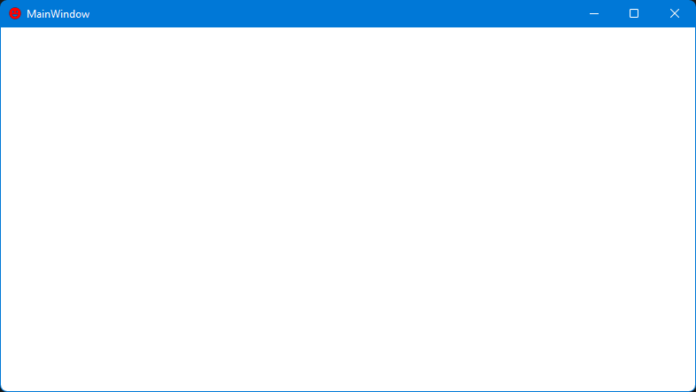

# Window.Icon

Window.Icon is an example project which shows how to convert the included [Material Design Icons](https://materialdesignicons.com/) delivered via the `PackIcon` control into an [`ImageSource`](https://docs.microsoft.com/en-us/dotnet/api/system.windows.media.imagesource) and bind it to the [`Window.Icon`](https://docs.microsoft.com/en-us/dotnet/api/system.windows.window.icon) property. 

## Visual



## Code documentation

### XAML

First, a reference to the `VisualToImageSourceConverter` is added to the `Window.Resources` [`ResourceDictionary`](https://docs.microsoft.com/en-us/dotnet/api/system.windows.frameworkelement.resources):

```xaml
<Window.Resources>
    <local:VisualToImageSourceConverter x:Key="VisualToImageSourceConverter" />
</Window.Resources>
```

Then a `Binding` is specified, using the registered converter, between the [`Window.Icon`](https://docs.microsoft.com/en-us/dotnet/api/system.windows.window.icon) property and an instance of the `PackIcon` control. The `Kind` property picks the `Smiley` glyph (from the `PackIconKind` enum), and the `Height`, `Width` and `Foreground` properties set the desired visual display properties for use on the window.

```xaml
<Window.Icon>
    <Binding Converter="{StaticResource VisualToImageSourceConverter}">
        <Binding.Source>
            <materialDesign:PackIcon Kind="Smiley" Width="30" Height="30" Foreground="Red" />
        </Binding.Source>
    </Binding>
</Window.Icon>
```

The `Convert` method of the `VisualToImageSourceConverter` class first creates a [`Rect`](https://docs.microsoft.com/en-us/dotnet/api/system.windows.rect.-ctor) of the specified height and width. Then the `VisualToImageSourceConverter` uses the [`RenderTargetBitmap`](https://docs.microsoft.com/en-us/dotnet/api/system.windows.media.imaging.rendertargetbitmap) framework class to `Render` the glyph in the [`PixelFormats.Pbgra32`](https://docs.microsoft.com/en-us/dotnet/api/system.windows.media.pixelformats.pbgra32) format into the `Rect`, while accounting for a display DPI of 96.

```csharp
public object Convert(object value, Type targetType, object parameter, CultureInfo culture)
{
    if (value is FrameworkElement element)
    {
        element.Measure(new Size(element.Width, element.Height));
        element.Arrange(new Rect(new Size(element.Width, element.Height)));
        var rtb = new RenderTargetBitmap((int)Math.Ceiling(element.ActualWidth), 
            (int)Math.Ceiling(element.ActualHeight), 96, 96, PixelFormats.Pbgra32);
        rtb.Render(element);

        return rtb;
    }

    return null;
}
```
> Note: in a production application, the real client DPI should be taken into account.