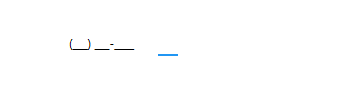

# MaskedTextBox

MaskedTextBox is an example project which shows how to use the WpfToolkit MaskedTextBox

## Visual


> Note: This GIF has compression artifacts

## Code documentation

### XAML

Read the full official documentation [MaskedTextBox](https://doc.xceed.com/xceed-toolkit-plus-for-wpf/Xceed.Wpf.Toolkit~Xceed.Wpf.Toolkit.MaskedTextBox.html) here. 
This mask simulates a phone number, but other masks can be defined as specified in the documentation.

```xaml
<xctk:MaskedTextBox Mask="(000) 000-0000" Width="200" HorizontalAlignment="Center" VerticalAlignment="Center"
                    ValueDataType="{x:Type s:String}" />
```